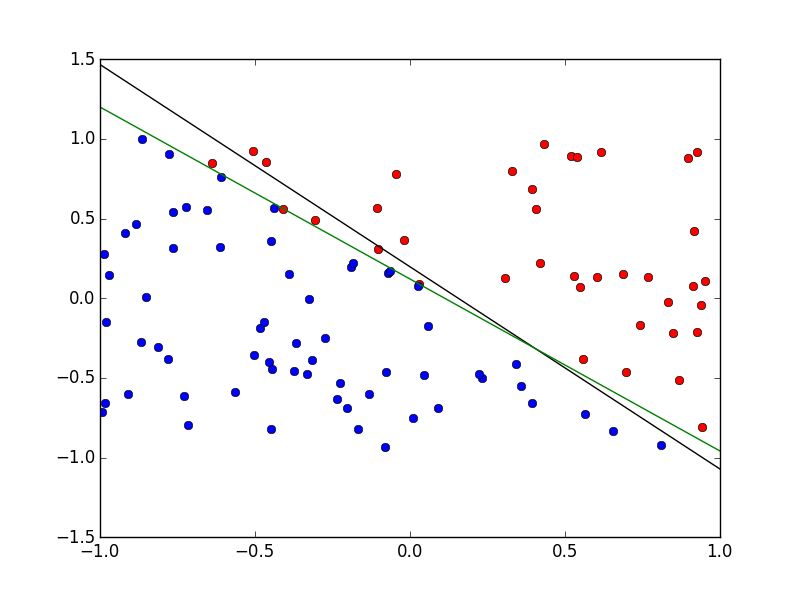

## Description of Algorithms and Design Decisions

### `generateData(N)`

This function is used to create 2-D training data that are linearly seperable. A  uniformly distributed sample of $2N$ points in $[-1, 1]$ is created and reshaped to an $N \times 2$ matrix. Two points from this matrix are randomly selected to create the target line that seperates the $N$ points. From these points, the slope and intercept are calculated, and each point in the training data is evaluated to be above the line. Those points above the line are labeled as $1$ and $-1$ otherwise. This evaluation of each point relative to the target line is vectorized for efficiency.

### `pla(X, Y, w0)`

This function takes the randomly generated $m \times n$ training data and labels $(X, Y)$, and learns the approximate target function. The learned function linearly seperates the training data $X$ according to the labels in $Y$. By default, this algorithm initializes the weight vector $w$ to the zero vector of length $n + 1$, though it can accept an initial weight vector output by `pseudoinverse`. The algorithm also preappends $X$ with the bias term, a vector of ones of length $m$. The algorithm uses a boolean flag to check if the learned weight vector $w$ has convereged. While the boolean flag is `False`, the algorithm checks if $w^T \cdot X$ is equivalent with $Y$. If they are equivalent, the boolean flag flips to `True`, and the algorithm returns the learned weight vector $w$ and the number of iterations needed to converge. If the hypothesis and label vectors are not equal, a misclassified point $X_i$ is randomly chosen, and $w$ is updated to $w + X_iY_i$. When the weight vector is updated, the number of iterations is incremented. A random point is chosen, so that the algorithm doesn't get stuck trying to correctly classify the same point repeatedly, when that point might get classified correctly in one iteration when a different point is used to move the weight vector.

### `pseudoinverse(X, Y)`

This function takes the randomly generated $m \times n$ training data $X$ and its continuous label vector $Y$, and returns the line of best fit that minimizes the squared error. First the algorithm preappends $X$ with the bias term, a vector of ones of length $m$. Then the dot product of the pseudoinverse of $X$ and $X^T$ is returned. The pseudoinverse is the inverse of the dot product $X$ and $X^T$.

## Experiments

`pla` was tested on training samples of various sizes with and without an initialized weight vector $w_0$ from `pseudoinverse`. For each $N$ in $\{10, 50, 100, 200, 500, 1000\}$ data was randomly generated 100 times, and the same random data was fed to `pla` with and without the initialized weight vector. The average number of iterations to convergence was calculated for each value of $N$ with and without $w_0$. The summary results are tabulated and plotted below.

```{r, echo=FALSE, message=FALSE, fig.width=6.5}
setwd("~/DSBA 6156/ML_implementations")

# load libraries
library(ggplot2)
library(dplyr)
library(knitr)

file <- "hw2-results.csv"
dat <- read.csv(file, stringsAsFactors = FALSE)

# summarize data
dat_summary <- dat %>% group_by(n, initialized) %>% 
    summarise(mean_iters = mean(iters),
              sd_iters = sd(iters),
              min_iters = min(iters),
              max_iters = max(iters))

# plot means
ggplot(dat_summary, aes(n, mean_iters, fill=initialized)) + 
    geom_bar(stat="identity", position="dodge") + 
    facet_grid(.~n, scales="free") +
    theme(axis.text.x=element_blank(),
          axis.ticks.x=element_blank()) +
    labs(x="Training Set Sample Size",
         y="Mean Iterations",
         title="Mean iterations to Convergence with and without Initialization")

# print
kable(dat_summary,
      col.names = c('sample size', 'initialized', 'mean iterations',
                    'standard deviation', 'min', 'max')
      )
```

From the graph, it is clear that the value of $N$ increases the mean number of iterations exponentially, but it is less clear if the initialization has an effect on iterations. A clue that there might not be an effect is that the variance of iterations to convergence increases with $N$. To make a rational conclusion about the within group difference in means, a T-test is performed on the two groups of 100 trials for each value of $N$. The results are tabulated below.

```{r, echo=FALSE}
# t-tests
t_test <- function(df, sample_size) {
    no = filter(df, (n==sample_size & initialized=='no')) %>% select(iters)
    yes = filter(df, (n==sample_size & initialized=='yes')) %>% select(iters)
    return(t.test(no, yes))
}
ttest10 <- t_test(dat, 10)
ttest50 <- t_test(dat, 50)
ttest100 <- t_test(dat, 100)
ttest200 <- t_test(dat, 200)
ttest500 <- t_test(dat, 500)
ttest1k <- t_test(dat, 1000)

t <- list(ttest10, ttest50, ttest100, ttest200, ttest500, ttest1k)
nt <- length(t)

mu_wo <- sapply(1:nt, function(x) t[[x]][[5]][[1]])
mu_w <- sapply(1:nt, function(x) t[[x]][[5]][[2]])
lower <- sapply(1:nt, function(x) t[[x]][[4]][[1]])
upper <- sapply(1:nt, function(x) t[[x]][[4]][[2]])
p <- sapply(1:nt, function(x) t[[x]][[3]])

results <- data.frame(n = c(10, 50, 100, 200, 500, 1000),
                      mean_uninitialized = mu_wo,
                      mean_initialized = mu_w,
                      lower_est = lower,
                      upper_est = upper,
                      p_value = p
                      )

kable(results,
      col.names = c('sample size', 'uninitialized mean', 'initialized mean',
                    'lower bound estimated difference', 
                    'upper bound estimated difference', 'p value')
      )
```

The table gives a lower and upperbound on the 95% confidence interval of the difference in means between the two groups as well as the p value. There does not appear to be a statistically significant difference in the mean iterations to convergence with or without initializing the weight vector with linear regression. All of the confidence intervals include 0, and the p values are all much greater than 0.05, so the null hypothesis - that the true difference in means is zero - cannot be rejected.

It is likely that initializing the weight vector had no effect on the number of iterations, because the `pla` algorithm was guaranteed to converge. So, even a small deviation from linear separation might take several iterations to correct, because small errors will lead to small adjustments in the decision boundary. (See appendix for visual). The initialized weight vector might be more useful for the pocket algorithm, in the case where linear separation is not possible, but the algorithm might get closer to convergence if it starts closer.

## Appendix

Below is a visualization of the randomly generated data for $N = 100$. The points are colored by their true labels. The green line is the decision boundary learned by `pla`, and the black line is the decision boundary initialized by `pseudoinverse`. One can see that the initial decision boundary is close to the decision boundary, but this does not guarantee fewer iterations, since small errors will lead to small adjustments.  
